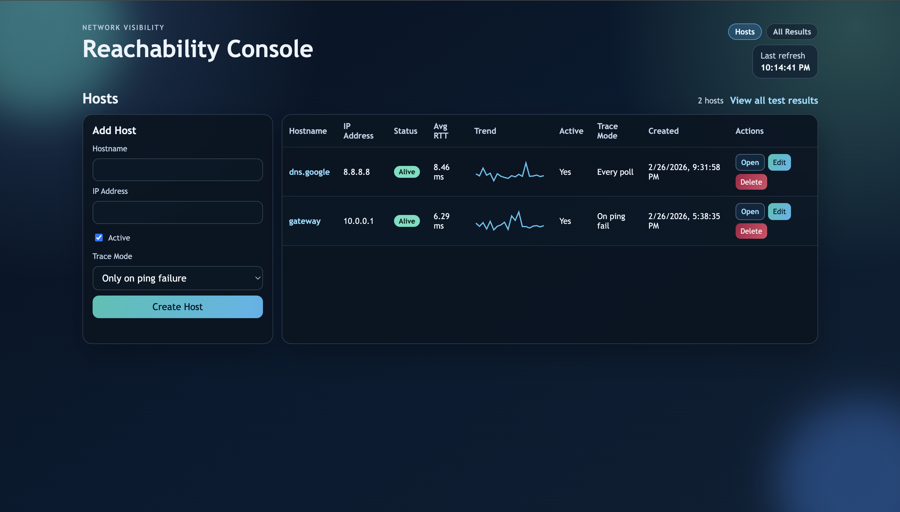
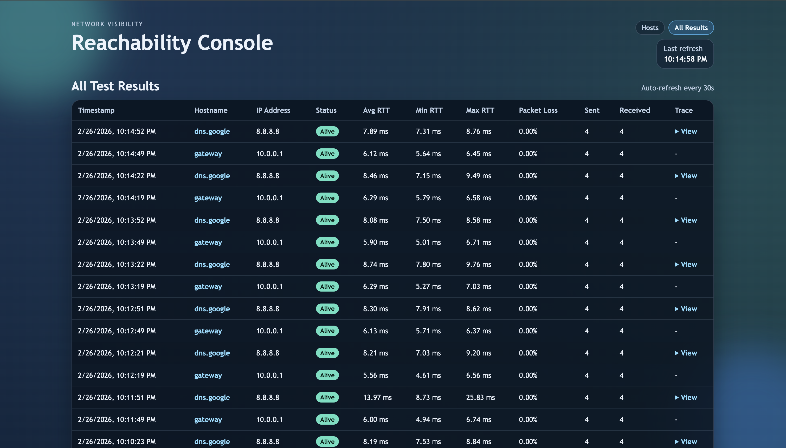
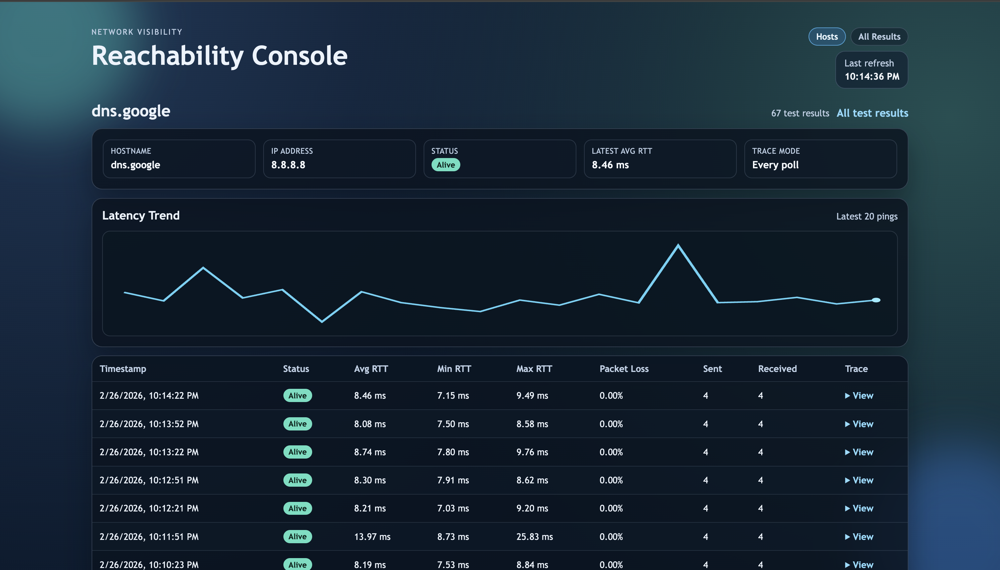

# r/Networking Ping

r/Networking Ping is a lightweight reachability dashboard for:
1. Managing hosts.
2. Running scheduled ping checks.
3. Capturing traceroute output (`always` or `on_fail` per host).
4. Viewing host trends and test history.

## Screenshots
### Hosts Dashboard


### All Test Results


### Host Detail View


Screenshots are stored in `docs/images/`.

## Features
1. Host CRUD (add/edit/delete, active state).
2. Per-host trace mode (`on_fail` or `always`).
3. Global test results page.
4. Host details page with recent trend sparkline and test history.
5. Celery polling scheduler for recurring checks.

## Local Development (Poetry)
```bash
# from project root
poetry install

# database migration (sqlite by default)
poetry run python app/manage.py migrate

# start web app
poetry run python app/manage.py runserver

# in a separate shell: start celery worker
cd app
poetry run python -m r_networking_ping.celery_compat -A r_networking_ping worker --loglevel=info

# in a separate shell: start celery beat
poetry run python -m r_networking_ping.celery_compat -A r_networking_ping beat --loglevel=info
```

Open: `http://127.0.0.1:8000`

## Docker Development
```bash
# from project root
docker compose -f docker-compose.dev.yml up --build
```

Run migrations:
```bash
docker compose -f docker-compose.dev.yml run --rm web python manage.py migrate
```

`docker-compose.yml` is the same development stack.

## Docker Production
See full details in [docs/DEPLOYMENT.md](docs/DEPLOYMENT.md).
Docs index: [docs/README.md](docs/README.md).

Quick start:
```bash
# required runtime env values
export TRAEFIK_HOST=ping.example.com
export DJANGO_ALLOWED_HOSTS=ping.example.com
export WEB_REPLICAS=3

# migrate once
docker compose -f docker-compose.prod.yml --profile ops run --rm migrate

# start stack with replicas
docker compose -f docker-compose.prod.yml up -d --build --scale web=${WEB_REPLICAS:-3}
```

Production stack includes:
1. Traefik load balancing in front of Django/Gunicorn.
2. Hostname and direct IP routing to Django.
3. Web service replicas.
4. Memory limits for core services.

## Environment Variables
App env (`app/.env`) example:
```bash
DJANGO_DEBUG=True
DJANGO_SECRET_KEY=replace-me
DJANGO_ALLOWED_HOSTS=localhost,127.0.0.1
DJANGO_TIME_ZONE=UTC
PING_PRIVILEGED=False
SQL_ENGINE=django.db.backends.postgresql
SQL_DATABASE=r_networking_ping
SQL_USER=r_networking_ping
SQL_PASSWORD=change-me
SQL_HOST=db
SQL_PORT=5432
```

DB env (`.db.env`) example:
```bash
POSTGRES_USER=r_networking_ping
POSTGRES_PASSWORD=change-me
POSTGRES_DB=r_networking_ping
```
